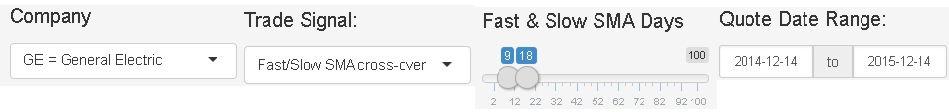

### What is Trade Analyzer (TA)?

1. TA is a powerful, low cost, web application to test your multi-day trading ideas.
2. While there are many sites that will allow you to create charts and even do some technical anlaysis, none that are free (that I'm aware of) allow you to actually test your trading strategy based on your inputs.
3. Intended for traders who hold positions longer than a single day (swing traders)
  - Not intended for traders who enter and exit multiple times per day (day traders)
4. Can use free or subscription-based data services
  - Module to download (currently free) stock data from <b>finanace.yahoo</b> is available.
  - Applications like [TradeStation](http://www.tradestation.com/products/stocks-and-etfs/pricing) or [ThinkOrSwim](https://www.thinkorswim.com/t/innovation.html) require opening accounts with their brokerages while others like [TC2000] (https://www.worden.com/offerterms) charge a monthly fee.
  - With TA, you can do your analysis for free without being tied to a broker.
5. Future features will include machine learning algorithms to fine-tune your strategy to maximize profitablity.
  - Current functionality allows users to test just their specified strategies

--- 

### How might I use TA? (push right or down arrow to continue...)

> * You read somewhere on the internet that many successful stock traders follow trends.
> * You decide to research trend following strategies and discover the [fast/slow simple moving average (SMA) cross-over strategy](http://www.onlinetradingconcepts.com/TechnicalAnalysis/MASimple2.html).
> * You are intrigued.  It's Christmas Eve 2015 and all your holiday preparations are finished.  So you visit one of the many sites that provide free stock charts (e.g. [bigcharts.com](http://bigcharts.marketwatch.com)) and look at a one year chart for General Electric (ticker GE).
> * To your delight, you discover that you can plot two SMAs together on the same chart!
> * So you create a chart that overlays a 9 and 18 day SMA and it looks like [this.](./assets/img/geYtd2015.12.24.jpg)
> * You can see from this chart that you would have made some money if you bought in late January 2015 and sold somewhere near mid-April.
  - Remember how the strategy works: When the gold line (fast SMA) rises above the blue line (slow SMA), you buy.  When the gold line drops below the blue line, you sell.
> * You think... "This is pretty cool, but some of the other trades look like they lost money.  Trying to figure out if this strategy would have made money over the whole year would be a lot of tedious work!  I wonder if there is an app that could help with this?"

--- 

### There's an app for that... Trade Analyzer to the rescue!

If you enter these settings into TA and click the <b>Run Simulation</b> button

you'll see the results of your test starting with a $10,000 USD account using an all-in-all-out position management strategy.  These would be the trades TA would find:

```{r echo=FALSE}
geSim <- read.csv("./data/ge_2014.12.14to2015.12.14.csv")
geSim[,-1]
```
TA even tells you that you would have made about `r paste0("$ ", round(sum(geSim$ProfitLoss), 0))` if you would have used this strategy over the course of 2015.  Think of how much time TA just saved you!


--- 

### Trade Analyzer Additional Features

* In the **Graphics** tab, TA will show you visually where the buy and sell signals for your strategy were.
* Also in the **Graphics** tab, TA will show you a histogram summarizing the results of the simulated trades for the given settings you chose in the left configuration pane.
* TA opens to the **Users Guide** tab which explains the basic operation and the settings in the left configuration pane.
* Finally, the last tab on the right named **Signal** describes in more detail how the buy and sell signals are generated for your selection.  

So what are you waiting for?  Take the **Trade Analyzer** out for a spin today by going [here.](https://michael-szczepaniak.shinyapps.io/tranalyzer)

Have fun, make money and remember: Test it before you trade it!  

###### DISCLAIMER:  USE AT YOUR OWN RISK.  THIS PRESENTATION IS ONLY FOR EDUCATIONAL PURPOSES.  PLEASE DO YOUR HOMEWORK BEFORE ENGAGING IN REAL TRADING.  THE TA APPLICATION HAS NO WARRANTY AND NO CLAIMS REGARDING ACCURACY ARE BEING MADE OR IMPLIED IN THIS PRESENTATION.